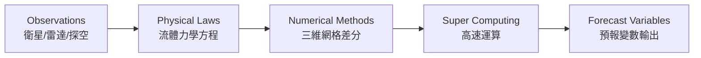
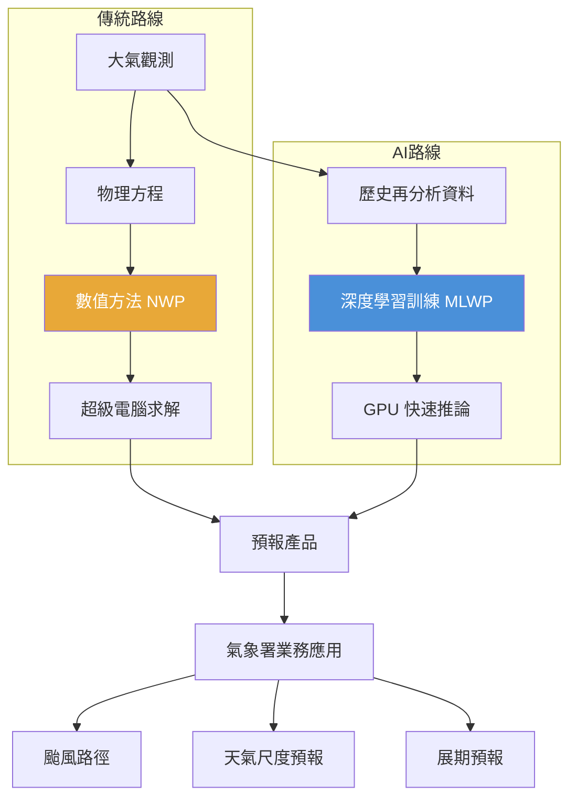

# 分組一：天氣與氣候預報模型開發

> **講者**：科技發展組 劉正欽 副研究員  
> **時段**：2026/04/20（上午）  
> **來源**：`20260420_新進同仁AI教育訓練_分組一_天氣與氣候預報模型開發.pptx`

---

## 1. 氣象署的核心使命

氣象署的願景可歸納為五大方向：

| 面向 | 目標 |
|------|------|
| 預報精度 | 讓預報「**更準、更早、更細**」 |
| 資訊傳達 | 讓資訊「**更好懂、更好用**」 |
| 預警效能 | 讓警示「**更有感、更可信**」 |
| 教育推廣 | 推動氣象教育與素養 |
| 氣候調適 | 面對氣候變遷的角色升級 |

> 核心關鍵字：**預報**（天氣或氣候）——這是氣象署所有 AI 應用的出發點。

---

## 2. 氣象業務場景：天氣預報的演進

### 2.1 從經驗預報到數值預報

天氣預報起源於**觀測現況**，再透過歸納與演繹進行推理：

#### 傳統經驗預報（諺語觀天）

| 諺語 | 科學解讀 |
|------|---------|
| 「龜山戴黑帽，若瞇雨就落」 | 龜山島上有烏雲籠罩時，蘭陽平原即將降雨 |
| 「空中魚鱗天，不雨也風顛」 | 卷積雲出現後天氣轉壞，約半天後風速增強，雲層增厚產生降雨 |
| 「天有城堡雲，地上雷雨臨」 | 堡狀層積雲/高積雲底平頂凸，夏天早晨出現時，白天對流發展易引發雷雨 |

### 2.2 大氣觀測系統（圖片解析）

天氣預報的起點是觀測。簡報以三張圖片完整呈現現代氣象觀測的三個層次：

#### 圖一：地面氣象觀測站（觀測坪）
> 來源：`raw_data/pic1.jpg`

照片為氣象署典型的**地面觀測坪**，可見的儀器包括：
- **百葉箱**（白色木造箱體）：內置溫度計與濕度計，遮蔽日曬確保通風
- **雨量計**（金屬圓筒形）：量測降水量
- **蒸發皿**（大型金屬盤）：量測蒸發量
- **風速風向計**（高桿頂端）：量測地面風場
- **日照計**、**地溫計**等其他輔助儀器

這是氣象預報最基礎的資料來源——**地面觀測 (Surface Station)**。

#### 圖二：WMO 全球觀測系統 (Global Observing System, GOS)
> 來源：`raw_data/pic2.jpg`

此圖展示 WMO 定義的全球觀測網絡架構，所有觀測資料最終匯入**國家氣象服務中心 (NMS)**：

| 觀測平台 | 說明 |
|---------|------|
| **Polar Orbiting Satellite** | 繞極衛星，低軌道掃描全球（約 850 km 高度） |
| **Geostationary Satellite** | 同步衛星，固定於赤道上空（約 35,800 km），連續觀測 |
| **Satellite Soundings** | 衛星垂直剖面探測（溫度、濕度垂直分佈） |
| **Satellite Ground Station** | 衛星地面接收站 |
| **Satellite Images** | 衛星雲圖影像 |
| **Aircraft** | 航空氣象觀測（飛機沿線觀測） |
| **Ocean Data Buoy** | 海洋資料浮標（海面氣壓、海溫、浪高） |
| **Weather Ship** | 氣象觀測船 |
| **Surface Station** | 地面氣象站（即圖一的觀測坪） |
| **Upper-Air Station** | 高空觀測站（探空氣球/無線電探空儀） |
| **Weather Radar** | 氣象雷達（降水分佈、風場） |
| **Automatic Station** | 自動氣象站 |

#### 圖三：全球氣象衛星星座分佈
> 來源：`raw_data/pic3.png`

此圖展示環繞地球的主要氣象衛星星座，分為兩類軌道：

**同步軌道衛星（赤道上空 ~35,800 km）**：
| 衛星 | 經度位置 | 營運機構 |
|------|---------|---------|
| GOES-R | 75°W / 135°W | 美國 (USA) |
| MSG / METEOSAT | 0° / 63°E | EUMETSAT（歐洲） |
| GMS-5 / MTSAT-1R | 140°E | 日本 |
| FY-2/4 | 105°E | 中國 |
| INSAT | 83°E | 印度 |
| GOMS | 76°E | 俄羅斯 |
| COMSAT-1 | 120°E | 韓國 |

**繞極軌道衛星（~850 km）**：
- FY-1/3（中國）、METEOR 3M（俄羅斯）、Metop（EUMETSAT）、NPOESS（美國）
- Terra、NPP、Aqua、TRMM、Jason-1、QuickSat（科研衛星）
- ENVISAT/ERS-2、SPOT-5（歐洲地球觀測）
- GPM/GCOM（全球降水觀測）

> **台灣的角色**：氣象署主要接收 **Himawari（MTSAT 後繼，日本）** 及 **GOES（美國）** 的資料，並透過 GTS（全球電信系統）取得各國衛星觀測資料。

---

#### 現代數值預報流程

```
大氣觀測  →  歸納現象  →  演繹為方程式  →  數值模式求解  →  預報產品
(衛星、雷達)    (物理定律)    (淺水方程等)     (超級電腦)      (天氣變數)
```



### 2.2 數值天氣預報 (NWP) 的定位

數值天氣預報的三個核心特質：

1. **一門科學**：整合數學、流體力學、數值方法、紊流、雲物理，需高度專業科學人才投入研發。
2. **一門產業**：結合高速運算、網路及各式資訊技術，需資訊產業全力支援。
3. **高成本、高技術門檻**：氣象科技及資訊科技的**協力合作**是成功關鍵。

> **關鍵洞察**：如何從大量資料中累積有價值的資訊，創造知識，發揮「預報」的價值——這就是**大數據與人工智慧**應用的核心議題。

---

## 3. 機器學習天氣預報 (MLWP)

### 3.1 為什麼要探討 MLWP？

在數值模式（NWP）已十分成功的基礎下，探索 MLWP 的科學理由：

| 問題 | 回應 |
|------|------|
| 推論（預報）速度快？ | 若沒有準度（與 NWP 相比），快也無用 |
| 有機會比 NWP 更準？ | 需實驗驗證。Dueben and Bauer (2018) 提出核心問題：*基於深度學習的預報模型能否與基於物理方程的天氣氣候模型競爭甚至超越？* |

### 3.2 科學基礎：通用近似定理 (Universal Approximation Theorem)

```
一層的前饋式神經網路即可近似任意連續函數
```

- 實務上，**網路的深度**與**隱藏層神經元數量**是準確度的關鍵 → 即**深度學習**
- 成功三要素：**資料** + **軟硬體** + **演算法**

### 3.3 MLWP 模型發展歷程（2022–2025）

#### 第 1 代：單一/決定性預報模型

| 年份 | 模型 | 開發機構 |
|------|------|---------|
| 2022 | **Pangu-Weather** | Huawei |
| 2023 | **GraphCast** | Google DeepMind |
| 2023 | **FengWu** | Shanghai AI Lab. |
| 2023 | **FuXi** | Fudan University |
| 2023 | **FourCastNet v2** | NVIDIA |
| 2024 | **AIFS-single** | ECMWF |
| 2024 | **Aurora** | Microsoft Research |

#### 第 2 代：系集/機率性預報模型（具展期預報潛力）

| 年份 | 模型 | 開發機構 |
|------|------|---------|
| 2024 | **FGN** | Google DeepMind |
| 2024 | **GenCast** | Google DeepMind |
| 2025 | **AIFS ENS** | ECMWF |
| 2025 | **FourCastNet v3** | NVIDIA |

#### 第 3 代（探索中）：End-to-End / Direct Observation Prediction

- Aardvark、GraphDOP、Huracan、FuXi weather

#### MLWP 技術趨勢筆記

- 當前 MLWP 作業預報仍**完全仰賴傳統 NWP 模式及資料同化技術**提供訓練資料及預報初始場
- 系集 MLWP 模型由「**擴散模型 (Diffusion Model)**」往「**運用系集資料讓 CRPS 最小化**」方式前進
- 多數模型採用 **Transformer 架構**（Vision Transformer, Shifted Window Transformer v1/v2）——Transformer 本質上是一種**圖神經網路 (GNN)**
- 開始出現 MLWP 模型**訓練框架**以加速開發與應用

---

## 4. 氣象署 MLWP 發展策略

### 4.1 優勢與待克服挑戰

| 類別 | 優勢 ✅ | 挑戰 ⚠️ |
|------|---------|---------|
| 速度 | 取得預報資料速度極快，可做大量系集 | — |
| 準度 | 兩週預報在部分變數已優於 NWP | 驗證度尚不足，展期預報表現待釐清 |
| 颱風 | 颱風路徑預報優於 NWP，屬**即戰力** | — |
| 開源 | 原始碼開源可作為訓練參考架構 | — |
| 解析度（空間） | — | 不足以滿足鄉鎮尺度業務需求 |
| 解析度（時間） | — | 無法滿足高時間解析需求 |
| 變數完整性 | — | 部分 MLWP 未提供降水資料 |
| 在地化 | — | 台灣資料不足，無法反映地形效應 |
| 邊界條件 | 新的邊界資訊選擇 | — |

### 4.2 核心精神

> **在業務精進的角度下，引領開源模型在地化應用與驗證，發展模型以補足缺口。**

### 4.3 雙軌策略

#### 應用模型（短中期目標）

1. 落地 **6 種開源 MLWP 模型**，驗證天氣尺度預報（~10 天）表現
2. 平行作業 MLWP 模型，提供**颱風路徑產品**給預報中心參考
3. 評估 MLWP 於**展期尺度預報（~45 天）**表現
4. 混合（Hybrid）NWP 與 AI 對天氣尺度預報之評估

#### 發展模型（中長期目標）

1. 合作建置及引進 **MLWP 框架**加速模型發展
   - 學研合作：**DLAMP**
   - 國際合作：**NCAR**
   - 自主研發：**Anemoi**
2. 先著重發展**區域 MLWP（決定性預報）→ 系集 MLWP**
3. 持續關注展期至氣候尺度 MLWP 發展，評估自行發展可行性

---

## 5. 關鍵術語表 (Glossary)

| 術語 | 英文 | 說明 |
|------|------|------|
| NWP | Numerical Weather Prediction | 數值天氣預報，以物理方程為基礎的預報方法 |
| MLWP | Machine Learning Weather Prediction | 機器學習天氣預報，以資料驅動的 AI 預報方法 |
| GOS | Global Observing System | WMO 全球觀測系統，整合衛星、地面、海洋等多平台觀測 |
| GTS | Global Telecommunication System | 全球電信系統，各國氣象資料交換網路 |
| NMS | National Meteorological Service | 國家氣象服務中心（如台灣氣象署） |
| 資料同化 | Data Assimilation | 將觀測資料融入數值模式以產生最佳初始場 |
| 通用近似定理 | Universal Approximation Theorem | 一個隱藏層的前饋神經網路可近似任意連續函數 |
| Transformer | Transformer Architecture | 基於注意力機制的深度學習架構，MLWP 主流 |
| Vision Transformer | ViT | 將影像切塊 (patch) 後以 Transformer 處理的視覺模型 |
| Swin Transformer | Shifted Window Transformer | 使用滑動視窗注意力的 Transformer 變體 (v1/v2) |
| GNN | Graph Neural Network | 圖神經網路，處理非歐幾里得結構資料 |
| 擴散模型 | Diffusion Model | 從噪聲逐步去噪生成資料的生成式模型 |
| CRPS | Continuous Ranked Probability Score | 評估機率預報品質的指標，越小越好 |
| 系集預報 | Ensemble Forecast | 以多組初始條件或模型進行群體預報，提供不確定性資訊 |
| 展期預報 | Extended-range Forecast | 超過 10 天至約 45 天的中長期預報 |
| ECMWF | European Centre for Medium-Range Weather Forecasts | 歐洲中期天氣預報中心，全球頂尖氣象機構 |
| Anemoi | Anemoi Framework | ECMWF 開源的 MLWP 訓練框架 |
| DLAMP | — | 學研合作的 MLWP 開發計畫 |
| NCAR | National Center for Atmospheric Research | 美國國家大氣研究中心 |

---

## 6. 參考文獻

- Dueben, P. D. and Bauer, P. (2018). *Challenges and design choices for global weather and climate models based on machine learning.* Geoscientific Model Development.
- WMO AI for Weather Task Team — MLWP 模型世代定義

---

## 7. 學習重點總結



### 三個核心要點

1. **NWP 仍是主流且不可取代**——MLWP 目前完全依賴 NWP 提供訓練資料與初始場
2. **MLWP 的即戰力在颱風路徑預報**——已優於數值模式，氣象署可直接應用
3. **氣象署採雙軌策略**——「應用開源模型」+「自主發展模型」，核心是在地化與業務精進
