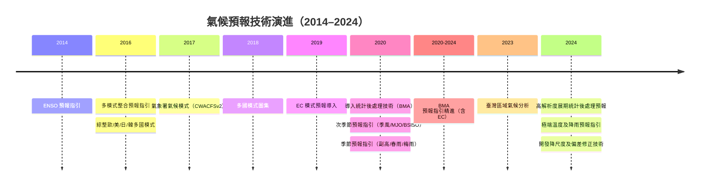
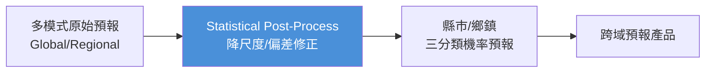
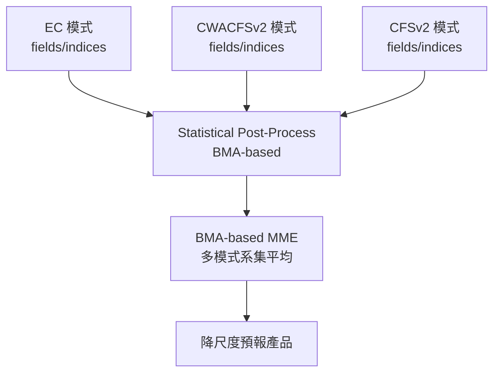
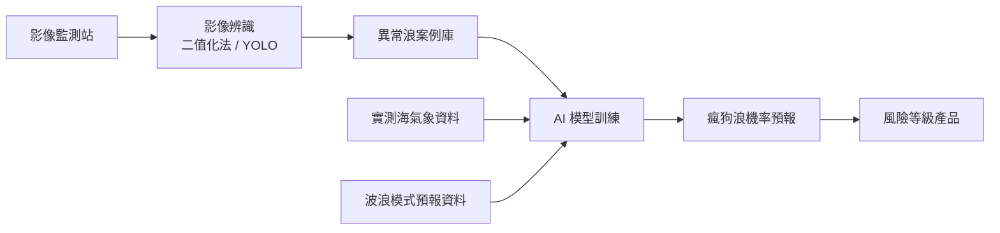
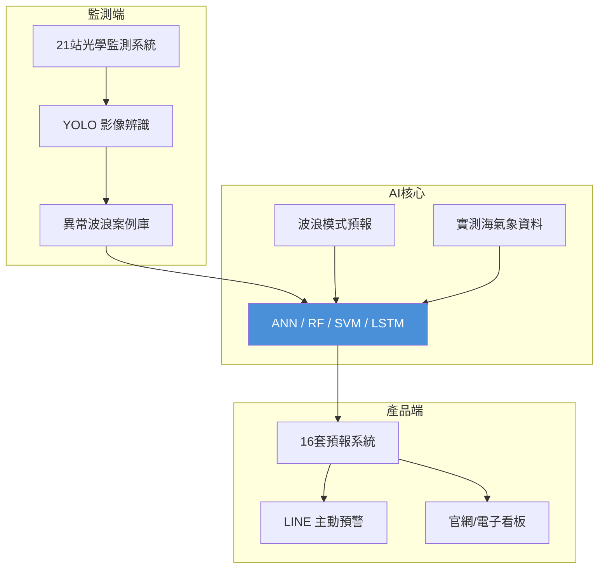

# 分組二：海象與氣候應用技術

> **本分組包含兩份簡報：**
> 1. 氣候預報統計/AI 後處理方法（李清縢，海象氣候組/氣候預報科）
> 2. 海岸異常波浪預報系統（朱啓豪科長，海象氣候組/海象發展科）
>
> **時段**：2026/04/20（上午）

---

# Part A：氣候預報——統計/AI 後處理方法

> **講者**：李清縢（海象氣候組/氣候預報科）  
> **來源**：`分組2_海象與氣候應用技術簡報-氣候.pptx`（18 頁）

---

## A1. 氣象署氣候預報產品

氣象署目前有兩類定期氣候預報產品：

| 產品 | 發布頻率 | 預報範圍 |
|------|---------|---------|
| **週預報** | 每週五下午 | 未來第 1 週、第 2 週、第 1–4 週 |
| **月/季預報** | 每月最後一天下午 | 未來第 1、第 2、第 3 個月 |

---

## A2. 氣候預報技術的跨世代演進



### 氣候預報的挑戰

- **預報誤差（可預報度限制）**：氣候系統的混沌特性
- **降尺度誤差**：全球模式解析度不足以描述台灣地形
- 需整合**多國模式資料與多系集成員**（含氣象署自身模式）

---

## A3. 氣候預報產品流程



### 跨域服務需求

氣候預報需服務多個領域，每個領域關注不同的氣象變數：

| 應用領域 | 關注的氣象變數 |
|---------|--------------|
| **水文 (Hydrology)** | 乾旱、極端降雨、颱風、暴雨 |
| **農業 (Agriculture)** | 低溫、高溫、強風 |
| **綠能 (Green Energy)** | 風速、風向、日照、雲量 |
| **漁業 (Fishery)** | 低溫 |

具體產品如：**水庫集水區雨量預報**等。

---

## A4. 統計後處理方法——BMA（Bayesian Model Averaging）

### 客觀綜合後處理方法 (OCP) 降尺度預報流程

BMA 方法整合多個模式的預報結果，賦予每個模式基於歷史表現的權重：



- **BMA (Bayesian Model Averaging)**：基於貝葉斯統計的模式平均方法
- 每個模式根據其歷史預報技巧獲得不同權重
- **降水驗證 (RPSS)** 顯示 BMA 整合後優於任何單一模式

---

## A5. AI 降尺度方法——CorrDiff（Generative Correction Diffusion Model）

### A5.1 CorrDiff 概述

CorrDiff 是 **NVIDIA 與氣象署合作開發**的生成式擴散模型降尺度方法：

| 項目 | 全球資料 (Input) | 區域資料 (Target) |
|------|-----------------|-------------------|
| **資料集** | ERA5 再分析 | CWA RWRF 分析 |
| **解析度** | 25 km | 2 km |
| **變數** | 850/500-hPa U, V, T, Height; U10, V10, T2, CWV | U10, V10, T2, 最大雷達回波 |

> **論文**：Morteza Mardani et al. (2025). *Residual corrective diffusion modeling for km-scale atmospheric downscaling.* Nature Communications Earth & Environment. doi:10.1038/s43247-025-02042-5

> **亮點**：於 **COMPUTEX 2024** 展示颱風凱米 (Gaemi) 的 CorrDiff 降尺度預報。

### A5.2 最佳化 CorrDiff 模組

**合作單位**：氣象署 (CWA) × 台灣師範大學 (NTNU) × 台灣大學 (NTU) × NVIDIA

| 訓練資料 | 空間解析度 | 訓練期 | 測試期 | 地面變數 | 高空變數 |
|---------|----------|--------|--------|---------|---------|
| **ERA5** (Global) | 25 km | 1991–2015 | 2016–2023 | 降水, T2M, U10M, V10M | 850/500-hPa U, V, T, Q, Z |
| **TReAD** (Regional) | 2 km | 1991–2015 | 2016–2023 | 降水, T2M, U10M, V10M | — |
| **TaiSA** (Regional) | 1 km | 1998–2015 | 2016–2023 | 降水, T2M | — |

### A5.3 台灣高解析網格資料

| 資料集 | 說明 | 解析度 | 時間範圍 |
|-------|------|--------|---------|
| **TReAD** (Taiwan Re-Analysis Downscaling) | 使用 WRF 模式從 ERA5 動力降尺度 | 2 km, 逐時 | 1979–2023 (45 年) |
| **TaiSA** (Taiwan Station-based Analysis) | 使用統計方法將測站資料轉為網格資料 | 1 km, 逐時 | 1998–2023 (25 年) |

| | TReAD | TaiSA |
|---|-------|-------|
| **優勢** | 動力一致性，包含模式狀態變數，涵蓋 45 年 | 網格化觀測資料，氣候一致性（地面真值） |
| **限制** | WRF 動力降尺度，非地面真值 | 僅地面變數、僅陸地 |

> **TReAD 資料下載**：https://data.depositar.io/en/dataset/tread

### A5.4 CorrDiff 敏感度實驗

測試不同輸入變數組合對降尺度品質的影響：

| 實驗 | Global 輸入 | Regional 輸出 | 結果 |
|------|-----------|--------------|------|
| P2P | 僅降水 | 降水 | 基線 |
| SF2P | 降水+地面變數 | 降水 | 改善 |
| 3D2P | 降水+地面+高空 | 降水 | 更佳 |
| **3D2All** | 降水+地面+高空 | 降水+地面全變數 | **最佳（RMSE 最小）** |

> **結論**：3D2All 配置的空間降尺度正確性最高。CorrDiff 模型有潛力改善相對於 ERA5 原始輸入的空間降雨準確度。

### A5.5 CorrDiff 應用於預報降尺度

#### 結合展期模式 (GEPSv2)
- CorrDiff 降尺度後的 GEPS 預報在東部地區強化了降水信號（4 天、8 天前置時間）
- 但 12 天前置時間無降水信號
- **需要偏差修正**（GEPSv2 → ERA5）

#### 結合氣候模式 (SEAS5)
- 一個月前置時間的 CorrDiff 預報能指出東台灣的強降水
- **問題**：山區有濕偏差 (wet bias)
- **需要偏差修正**（SEAS5 → ERA5）

### A5.6 現行 CorrDiff 的待解決問題

1. 僅使用 **4 年資料**訓練（不足）
2. **沒有雨量變數場直接輸出**
3. **無高解析地形資料**

---

## A6. 統計後處理的下一步：偏差修正


未來目標是將統計後處理方法與 AI 降尺度（CorrDiff）整合，達成**氣候預報精緻化**：
- 以屏東縣為例：溫度機率預報可細化至「偏低 0% / 正常 30% / 偏高 70%」，並標示氣候正常範圍（如 20.6~21.4°C）

---

# Part B：海岸異常波浪（瘋狗浪）預報系統

> **講者**：朱啓豪 科長（海象氣候組/海象發展科）  
> **來源**：`新人訓練-海岸異常波浪-20260323.pptx`（20 頁）

---

## B1. 什麼是海岸異常波浪（瘋狗浪）？

**定義**：海岸邊突然出現的巨大浪花，是**波浪與地形、礁岩、防波堤等結構物交互作用**的結果，常將人車沖入海中造成傷亡。

- **統計**：民國 89–114 年 11 月間，共蒐集 **445 件**海岸瘋狗浪事件，**778 人落海**
- **核心困難**：截至目前，瘋狗浪的發生**尚無法以理論公式預測何時、何地會發生** → 需利用 **AI**

---

## B2. 系統架構



### 運作規格

| 項目 | 規格 |
|------|------|
| 執行頻率 | 每日 4 次（UTC 00, 06, 12, 18） |
| 預警時距 | 未來 12、18、24 小時 |
| 風險等級 | < 50%（低）/ 50–70%（中）/ > 70%（高） |
| 預報系統數 | **16 套** |
| 監測站數 | **21 站** |

---

## B3. 影像辨識技術

### B3.1 二值化法（傳統物理方法）

```
原始影像 → 二值轉換 + 影像銳化 → 邊緣偵測 + 去雜訊 → 浪花邊界 → 浪花參數計算
```

#### 浪花參數與危害判定

| 參數 | 定義 |
|------|------|
| **浪花高度 (H_CFW)** | 自浪花邊緣偵測獲得 |
| **浪花單位寬度瞬時流量 (Q_CFW)** | 對瞬時浪花水量微分 |
| **浪花平均速度 (u_CFW)** | 瞬時流量 ÷ 浪花高度 |

**危害度判定公式** (Penning-Rowsell et al., 2005)：

$$FH = h \times (v + 0.5) + DF$$

其中 $h$ 為水深、$v$ 為流速、$DF$ 為其他影響因子。

| Flood Hazard (FH) | 危害程度 |
|-------------------|---------|
| FH < 0.75 | 低危害 |
| FH > 1.5 | 具危害性 |
| FH > 2.5 | 非常危險 |

> **系統採用 FH > 1.5 作為瘋狗浪判定準則**（Ramsbottom, 2006）

### B3.2 YOLO 物件偵測（AI 方法）

從傳統影像分析**轉進**至 YOLO 智慧 AI 判識：

| 特性 | 說明 |
|------|------|
| 架構 | 單一卷積神經網路 (CNN)，將影像切成多個網格 |
| 版本 | **YOLOv7**（測試更新版本後發現無顯著加速且增加標記成本） |
| 速度 | 比二值化法快 **10–100 倍** |
| 能力 | 已具備**即時辨識動態影片**能力 |

> **流程**：二值法找案例 (FH > 1.5) → 案例訓練 YOLO 模型 → 完成訓練開始使用

---

## B4. 案例蒐集成果

全台 18 個監測站累積的異常波浪案例數：

| 測站 | 所屬區域 | 累積案例數 |
|------|---------|----------|
| **龍洞** | 新北市東 | **20,086** |
| **野柳** | 新北市西 | **8,578** |
| 富岡 | 台東縣 | 7,314 |
| 碧砂 | 基隆市 | 5,790 |
| 石梯 | 花蓮縣 | 3,931 |
| 和平島 | 基隆市 | 2,268 |
| 西子灣 | 高雄市 | 1,574 |
| 永安 | 桃園市 | 1,243 |
| 安平 | 台南市 | 740 |
| 台中港 | 台中市 | 399 |
| 內埤 | 宜蘭縣 | 259 |
| 烏石 | 宜蘭縣 | 173 |
| 箔子寮 | 雲林縣 | 172 |
| 海興 | 屏東縣 | 161 |
| 布袋 | 嘉義縣 | 82 |
| 新竹港 | 新竹縣 | 71 |
| 外埔 | 苗栗縣 | 62 |
| 彰濱 | 彰化縣 | 49 |

---

## B5. AI 預報方法

系統使用四種 AI 方法進行機率預報：

| 方法 | 英文 | 核心特性 |
|------|------|---------|
| **類神經網路** | ANN (Artificial Neural Network) | 多層互連神經元，強大的非線性擬合能力，黑箱模型 |
| **隨機森林** | RF (Random Forest) | 基於決策樹的集成學習，自助抽樣+隨機特徵，抗過擬合 |
| **支撐向量機** | SVM (Support Vector Machine) | 核函數技巧將低維映射至高維，找最優超平面 |
| **長短期記憶網路** | LSTM (Long Short-Term Memory) | 門控機制控制訊息保留/遺忘，捕捉長時序依賴關係 |

---

## B6. 預報驗證成果

114 年 1–10 月各子系統預報驗證結果：

| 子系統 | 正確率 |
|--------|--------|
| 台南安平 | **88.2%** |
| 台中台中港 | 86.4% |
| 高雄西子灣 | 85.8% |
| 花蓮石梯 | 85.1% |
| 桃園永安 | 83.2% |
| 基隆碧砂 | 82.8% |
| 台東富岡 | 82.8% |
| 屏東興海 | 82.6% |
| 雲林萡子寮 | 81.4% |
| 嘉義布袋 | 81.1% |
| 新北龍洞 | 79.7% |
| 新北野柳 | 77.3% |
| 宜蘭內埤 | 69.2% |

> **各子系統整體預報正確率皆有約 7 成以上**，顯示預警資訊具可信度。

### 實際案例驗證

| 事件 | 預報機率 |
|------|---------|
| 2024/11/16 基隆嶼瘋狗浪 | **88.3%** |
| 2025/01/15 花蓮石梯坪瘋狗浪 | **91.2%** |

> 發布**高風險**警戒時段 **90%** 有瘋狗浪影像紀錄；**中風險**時段 **58%** 有記錄。

---

## B7. 產品推廣與合作

| 推廣方式 | 合作單位 |
|---------|---------|
| **LINE 推播** | 新北市政府消防局 |
| **官網置入** | 東北角及宜蘭海岸國家風景區管理處 |
| **電子看板** | 北海岸及觀音山國家風景區管理處 |
| **合作建站** | 臺灣港務股份有限公司 |

---

## B8. 系統總結



### 未來工作

1. **精進預報準確度**
2. **建立整合監控系統**
3. **跨域合作**：觀光署、新北市政府、臺灣港務、海巡署
4. **科普教育**：海象百問、報氣候短知識影片、YouTube 觀測直播

---

# 關鍵術語表 (Glossary)

| 術語 | 英文 | 說明 |
|------|------|------|
| BMA | Bayesian Model Averaging | 貝葉斯模式平均，依歷史表現加權整合多模式預報 |
| OCP | Objective Comprehensive Post-processing | 客觀綜合後處理方法 |
| CorrDiff | Corrective Diffusion Model | 生成式修正擴散模型，用於空間降尺度 |
| RPSS | Ranked Probability Skill Score | 評估分類機率預報的技巧分數 |
| ERA5 | ECMWF Reanalysis v5 | ECMWF 第五代全球再分析資料（25 km） |
| TReAD | Taiwan Re-Analysis Downscaling | 台灣再分析降尺度資料（WRF, 2 km, 1979–2023） |
| TaiSA | Taiwan Station-based Analysis | 台灣測站分析網格資料（1 km, 1998–2023） |
| SEAS5 | Seasonal Forecast System 5 | ECMWF 第五代季節預報系統 |
| GEPSv2 | Global Ensemble Prediction System v2 | 全球系集預報系統第二版 |
| CWACFSv2 | CWA Climate Forecast System v2 | 氣象署氣候預報系統第二版（海氣耦合模式） |
| MJO | Madden-Julian Oscillation | 乃赤道地區 30–60 天振盪，影響次季節預報 |
| BSISO | Boreal Summer Intraseasonal Oscillation | 北半球夏季季內振盪 |
| ENSO | El Niño–Southern Oscillation | 聖嬰–南方振盪，最重要的季節氣候預報因子 |
| FH | Flood Hazard | 洪水危害指標（判定瘋狗浪危害度） |
| YOLO | You Only Look Once | 單次推論物件偵測演算法（目前使用 v7） |
| ANN | Artificial Neural Network | 人工類神經網路 |
| RF | Random Forest | 隨機森林（集成學習） |
| SVM | Support Vector Machine | 支撐向量機 |
| LSTM | Long Short-Term Memory | 長短期記憶神經網路（時序預測） |
| WRF | Weather Research and Forecasting | 天氣研究與預報模式（動力降尺度使用） |

---

# 參考文獻

- Morteza Mardani et al. (2025). *Residual corrective diffusion modeling for km-scale atmospheric downscaling.* Nature Communications Earth & Environment. doi:10.1038/s43247-025-02042-5
- Penning-Rowsell, E. C. et al. (2005). *The benefits of flood and coastal risk management: a handbook of assessment techniques.*
- Ramsbottom, D. et al. (2006). *Flood risks to people: Phase 2 — guidance document.*
- TCCIP Newsletter NO.019：颱風與農業損失之跨年代變遷趨勢研究

---

# 學習重點總結

### Part A 氣候預報三個核心要點

1. **氣候預報靠多模式整合**——BMA 將歐美日韓+氣象署模式的預報加權平均，優於任何單一模式
2. **AI 降尺度 (CorrDiff) 是下一代方向**——將 25 km 全球資料降至 2 km，但目前仍需偏差修正
3. **台灣有獨特的高解析資料優勢**——TReAD（45 年 2 km）與 TaiSA（25 年 1 km）是訓練 AI 的寶貴資產

### Part B 海岸異常波浪三個核心要點

1. **瘋狗浪無法用物理公式預測**——必須仰賴 AI 方法（ANN/RF/SVM/LSTM）從歷史案例學習
2. **YOLO 影像辨識是關鍵突破**——比傳統二值化法快 10–100 倍，已能即時辨識動態影片
3. **系統已實際運作並具高準確度**——16 套系統、21 站監測，平均正確率 > 77%，高風險準確率達 90%
