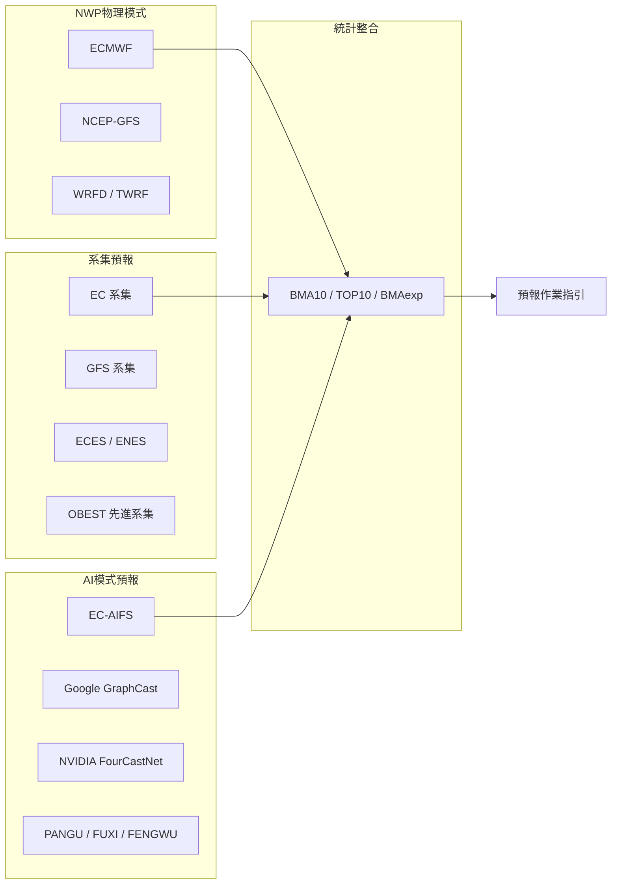
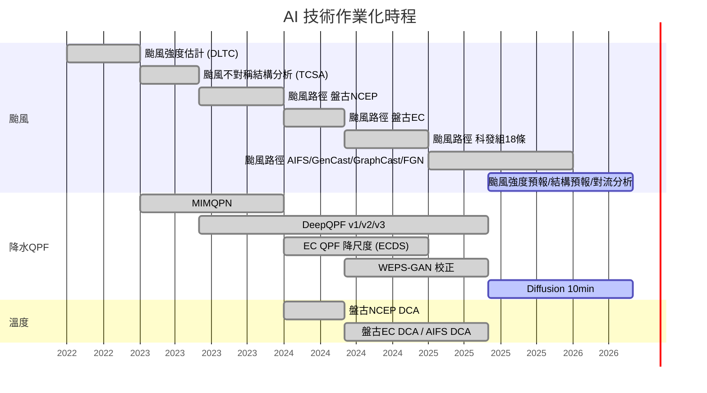

# 分組三：天氣預報與預警應用技術

> **講者**：  
> - 預報中心：黃椿喜主任、劉品妍科長、蕭純珉、黃俊翰  
> - 科技發展組：張保亮組長、陳新淦科長、劉正欽、林宜霖  
> - 合作廠商：台大陳柏孚博士團隊、多采科技  
>
> **時段**：2026/04/20（下午）  
> **來源**：`20260420_新進同仁AI教育訓練-天氣預報與預警應用技術.pptx`（26 頁）

---

## 1. 分組任務總覽

本分組由預報中心與科技發展組共同負責，涵蓋五大任務：

| # | 任務 |
|---|------|
| 1 | 發展 AI/ML 應用於**颱風分析及預報**的作業技術 |
| 2 | 發展 AI/ML 應用於**極短期天氣預警**的作業技術 |
| 3 | 應用與作業化**資料驅動天氣預報 (MLWP)** 模型 |
| 4 | 發展 AI/ML 應用於**數值模式預報的後處理加值**技術及產品 |
| 5 | 評估資料驅動天氣預報 (MLWP) 模型及其**後處理技術**發展 |

---

## 2. AI 預報百問——六大核心問答

簡報以 Q&A 方式串聯，以下逐一整理：

---

### Q1: AI 有多厲害？預報員現在都在用 AI 報天氣嗎？

**結論**：MLWP 模型與 AI 降尺度、後處理、颱風路徑預報等，已是**不可或缺的客觀預報指引**。預報員會參考所有預報指引（包含傳統 NWP 與 AI），發布最終預報。

#### 颱風路徑預報成果

- 過去 25 年颱風路徑 24 小時預報誤差年平均改善率約 **2.7%**
- **2025 年**：24、48 小時誤差較前一年降低 **12%、8%**，且優於美日 **13–16%**

---

### Q2: AI 報颱風真的很厲害嗎？

#### 2.1 颱風路徑預報系統架構

氣象署整合多來源模式達成早期預警，分為三大類：

| 類別 | 模型/系統 |
|------|----------|
| **全球 AI 模型** | 18 個（含 6 種開源模型：Google, NVIDIA, Microsoft 等） |
| **初始輸入資料** | 3 個（美國 GFS、歐洲 ECMWF、氣象署全球模式） |

#### 2.2 颱風路徑案例分析

##### 凱米颱風 (2024)
- AI 模式在**更早的時間**穩定預報出和實際相似的路徑
- 顯示颱風可能**停滯或偏折**
- 大幅精進颱風路徑預報準確度
- **限制**：中心遇地形打轉現象仍須**高解析區域模式**方能掌握

##### 山陀兒颱風 (2024秋)
- AI 預報較早掌握近台灣東部路徑
- **未能預測**通過巴士海峽轉南部登陸路徑
- 秋颱特殊路徑 + 北方系統交互影響 → 基隆北海岸雨量預報難度極高
- **教訓**：秋季颱風預測路徑仍難以掌握

#### 2.3 AI 颱風預報優缺點

| | 優點 ✅ | 缺點 ⚠️ |
|---|---------|---------|
| 大尺度 | 大範圍天氣系統預測能力佳 | 模型可解釋性不足 |
| 速度 | 比傳統模型更快 | 訓練消耗大量計算資源 |
| 多變數 | 可同時處理多種氣象變數 | 全球模型 (0.25°) 解析能力不足 |
| 颱風 | 生成與路徑預測具優勢 | 強度仍不足，風雨預報能力待釐清 |

#### 2.4 颱風結構分析及預報 AI 技術

| 技術 | AI 方法 | 功能 | 開發單位 |
|------|--------|------|---------|
| **DLTC** | GAN-CNN | 利用衛星雲圖估計颱風強度 | 委託台大陳柏孚團隊 |
| **TCSA / DSAT-2D** | GAN-CNN | 輸出軸對稱颱風風速剖面 → 二維風場及四象限結構 → 非對稱地面風場 | 同上 |
| **Deep-Rainband** | GAN | 以同步衛星觀測產製 PMW 雲圖，擺脫繞極衛星依賴，1 小時頻率提供強度/結構估計 | 同上 |
| **TCRI / TCRE** | GAN-CNN + convLSTM | 颱風系集預報，提供未來 24 小時快速增強 (RI) 發生機率 | 同上 |

---

### Q3: 前處理 & 後處理？那是什麼東西？

#### 3.1 預報指引作業化流程

加入 AI 後的變化：
- **前處理**：+ AI 訓練模型（資料整集、品質篩選、正規化）
- **後處理**：+ AI 模型（降尺度、偏差校正）
- 使用 **DockerFlow** 與**格點倉儲 (GT)** 管理作業流程

#### 3.2 前處理重點

前處理是將原始資料「洗乾淨」給 AI，關鍵步驟：

| 步驟 | 說明 |
|------|------|
| **異質資料處理** | 理解各資料特性、異常值（NaN、-999.9、負值）、不同單位須正規化 |
| **資料庫建立** | 例：無現成颱風剖面資料，需用 best-track + 物理方程式 + ERA5 反推軸對稱風速剖面 |
| **訓練目標篩選** | 根據目標挑選合適資料，如剔除過多弱天氣系統資料 |
| **計算精度** | 選擇 float32 或 float64 |
| **正規化** | 不同資料量值差異過大需正規化處理 |

#### 3.3 後處理——NWP 雨量預報 AI 降尺度

##### EC 降水預報降尺度 (ECDS)

| 項目 | 規格 |
|------|------|
| **方法** | Nested-Unet + 遷移式學習 |
| **輸入** | ECMWF 0.1° QPF + 高解析 0.0125° 地形 |
| **輸出** | 0.0125° QPF |
| **預報範圍** | 240 hr / 3、6、12、24 hr 累積雨量 |
| **訓練硬體** | RTX 6000（6–12 小時） |
| **推論時間** | CPU ~5 分鐘 |

**特色**：地形上降雨被增強，可提高強降雨可預報度，透過非線性方法提升解析度。

##### 系集預報降尺度 (WEPS-AI)

| 項目 | 規格 |
|------|------|
| **方法** | GAN + Swin-Transformer |
| **輸入** | WEPS mean 3 km QPF |
| **輸出** | 1 km QPF |
| **預報範圍** | 120 hr / 24 hr 累積雨量 |
| **訓練硬體** | GeForce RTX 3090（2–4 小時） |
| **推論時間** | ~2 分鐘 |

**特色**：學習 NWP 偏差後具有**空間訂正能力**，不同於傳統方法僅能改變雨量值但無法改變雨區。

##### 案例成效
- **米塔颱風 (2019)**：AI 修正降水極值大小及範圍
- **利奇馬颱風 (2019)**：加入地形資訊提高雨量空間解析度

#### 3.4 後處理——MLWP 雨量預報降尺度

- 將全球 MLWP 模式從 **25 km → 5 km**
- 修正系統性誤差、地形降雨效應
- 多模式可直接比較
- 預計部署至 **iQPF 網頁**

#### 3.5 後處理——AI 模式溫度降尺度

- **DCA (Downscaling Correction Approach)** 校正 AI 模式原始輸出
- 產出 **14 天逐時溫度預報**時間序列
- 整合至**圖形預報編輯系統 (GFE)** 作為溫度格點預報的基本材料（smart init 技術）

---

### Q4: AI 可以報午後雷陣雨嗎？

**結論**：自研模型在校驗指標上有所精進，但對流系統具高度不確定性，AI 預報目前僅具**初步參考潛力**，實務應用仍需長期且嚴謹地評估其穩定性。

#### 極短期降雨預報 (QPN) 三套系統

| 系統 | 方法 | 輸入 | 輸出 | 推論時間 |
|------|------|------|------|---------|
| **MIMQPN** | Memory-In-Memory | QPESUMS 最近 6 張雷達 CV + 降雨率 | 未來 20–70 min 之 60 分鐘雨量（逐 10 min 更新） | CPU 3–5 min |
| **DeepQPF** | convGRU + discriminator + PONI + 異質資料 | QPESUMS 6 張 + 地形/季節/舉升指數/位溫/風場 | 未來 3 小時內逐時時雨量 | CPU 2–3 min |
| **大台北強降雨預報** | ConvNeXt / U-net++ / simVP / ViT | RWRF 模式資料 | 未來 2–6 小時時雨量 > 10mm 格點 | — |

> **DeepQPF** 僅預報至 3 小時（3–6 小時可預報度較低）；大台北強降雨模型可報至 6 小時，但僅限初始時間 00–05Z。

#### 閃電躍升與決策樹

利用 **iREADs** 系統，結合分區午後對流達大雨的閃電躍升資料建立**決策樹**：

| 判斷條件 | 門檻值 |
|---------|--------|
| 連續閃電躍升數 | ≥ 3 |
| 20 分鐘雨量門檻 | 18.35 mm |
| 10 分鐘雨量門檻 | 6.75 mm |

分類結果：
- 分類 1：機率 0.307（低風險）
- 分類 2：機率 0.559（中風險）
- 分類 3：機率 0.806（高風險）

---

### Q5: AI 應用與傳統預報方法的長短處？

| | AI 應用 | 傳統方法 |
|---|---------|---------|
| **運算時效** | 極快：數秒至數分鐘 | 計算時間明顯較長 |
| **物理邏輯** | 黑盒子，可解釋性低 | 空間連貫性與物理一致性高 |
| **主要長處** | 中長期 (3–14 天) 大尺度預報穩定；修正偏差/降尺度成效佳 | 物理結構完整；中小尺度/地形效應掌握較佳 |
| **主要短處** | 缺乏明確物理因果 | 運算成本高、延遲時間長 |

#### AI 應用策略（依預報時間尺度）

---

### Q6: 預報員要被 AI 取代了嗎？

**答案：不會！**

| 角色 | 職責 |
|------|------|
| **AI** | 負責運算——大規模數據處理、模式優化與高效率結果推論，提供準確及快速的參考指引 |
| **預報員** | 負責核心價值——最後的物理診斷、面對民眾的風險溝通、災防決策制定，承擔最終決策責任 |

---

## 3. AI 技術導入時間軸（2022–2026）

---

## 4. 關鍵術語表 (Glossary)

| 術語 | 英文 | 說明 |
|------|------|------|
| MLWP | Machine Learning Weather Prediction | 機器學習天氣預報（資料驅動模型） |
| NWP | Numerical Weather Prediction | 數值天氣預報（物理方程驅動） |
| OBEST | Observation-Based Ensemble Subsetting Technique | 基於觀測的系集子集選擇技術 (Dong & Zhang, 2016) |
| BMA | Bayesian Model Averaging | 貝葉斯模式平均，以歷史表現加權 (Chen et al., 2017) |
| GAN | Generative Adversarial Network | 生成式對抗網路 |
| CNN | Convolutional Neural Network | 卷積神經網路 |
| convLSTM | Convolutional LSTM | 卷積長短期記憶網路（時空序列） |
| convGRU | Convolutional GRU | 卷積門控循環單元 |
| Swin-Transformer | Shifted Window Transformer | 滑動視窗 Transformer（用於降尺度） |
| ViT | Vision Transformer | 視覺 Transformer |
| U-net++ | Nested U-Net | 巢狀 U-Net 架構 |
| ConvNeXt | Convolutional Next | 現代化 CNN 架構 |
| simVP | Simple Video Prediction | 簡單影片預測架構 |
| PONI | — | DeepQPF 中的降水校正模組 |
| YOLO | You Only Look Once | 物件偵測演算法 |
| DCA | Downscaling Correction Approach | 降尺度校正方法 |
| GFE | Graphic Forecast Editor | 圖形預報編輯系統 |
| GT | Grid Toolbox | 格點倉儲（搭配 DockerFlow） |
| iQPF | — | 定量降水預報網頁平台 |
| iREADs | — | 即時分析診斷系統（閃電躍升預警） |
| QPESUMS | Quantitative Precipitation Estimation and Segregation Using Multiple Sensors | 多元感測器定量降水估計系統 |
| QPF | Quantitative Precipitation Forecast | 定量降水預報 |
| QPE | Quantitative Precipitation Estimation | 定量降水估計 |
| QPN | Quantitative Precipitation Nowcasting | 極短期定量降水預報 |
| DLTC | Deep Learning Typhoon Center | 深度學習颱風強度估計 |
| TCSA | Typhoon Complete Structure Analysis | 颱風完整結構分析（二維風場） |
| DSAT-2D | — | 颱風非對稱地面風場分析 |
| TCRI / TCRE | Typhoon Rapid Intensification / Ensemble | 颱風快速增強機率預報 |
| PMW | Passive Microwave | 被動微波（衛星觀測） |
| RI | Rapid Intensification | 颱風快速增強（24h 風速增加 ≥ 30 kt） |
| WEPS | Weather Ensemble Prediction System | 天氣系集預報系統 |
| ECDS | EC Downscaling System | EC 降水預報降尺度系統（預報中心自研） |
| RMW | Radius of Maximum Wind | 最大風速半徑 |
| R34 | Radius of 34-kt Wind | 34 節風速半徑 |
| Vmax | Maximum Sustained Wind | 最大持續風速 |

---

## 5. 參考文獻

- Dong, L. and Zhang, F. (2016). OBEST: An observation-based ensemble subsetting technique for tropical cyclone track prediction.
- Chen, B.-F. et al. (2017). Bayesian model averaging for tropical cyclone track forecasting.
- ECMWF AIFS 相關文獻

---

## 6. 學習重點總結

### 三大核心要點

1. **AI 已是預報作業不可或缺的指引**——颱風路徑預報 24h 誤差年改善率 2.7%，2025 年更較前年降低 12%，整合 18 個全球 AI 模型 + 3 種初始場。

2. **前處理與後處理是 AI 落地的關鍵**——前處理將原始資料「洗乾淨」（異質資料處理、正規化、品質篩選）；後處理將預報「精緻化」（降尺度 25km→5km、偏差校正、GAN/Transformer 空間訂正）。

3. **AI 不取代預報員，而是分工合作**——AI 負責運算與參考指引，預報員負責物理診斷、風險溝通與最終決策責任。極短期對流預報（午後雷陣雨）AI 仍僅具初步參考潛力。
