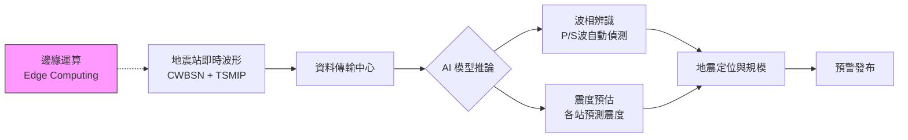
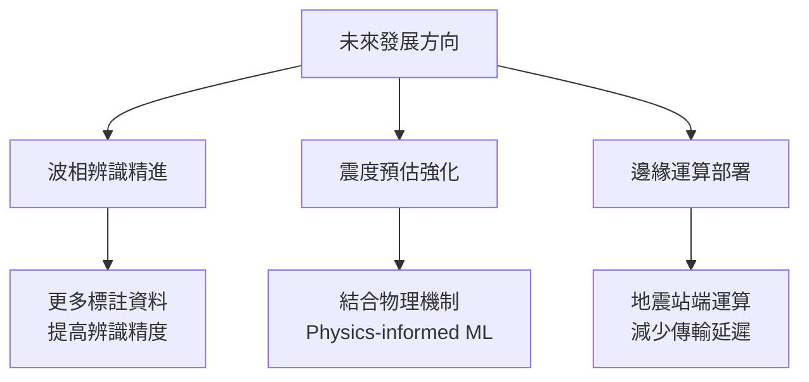

# 分組 4 — 人工智慧於地震預警系統上的應用

> **講者**：陳達毅 科長（中央氣象署 地震測報中心）  
> **日期**：2026-04-20  
> **投影片數**：18  
> **原始檔案**：`raw_data/分組4_地震預警應用技術.pptx`

---

## 1 背景與緣起

### 1.1 地震預警系統（EEW）的挑戰

地震預警系統的核心目標是在破壞性 S 波抵達前，提供數秒至數十秒的預警時間。傳統演算法在震度預估的準確性已接近瓶頸，難以進一步提升。

### 1.2 案例探討 — 114/11/10 高雄市甲仙區 M5.4 地震

| 項目 | 數值 |
|------|------|
| 規模 | M 5.4 |
| 位置 | 高雄市甲仙區 |
| 第一報發報時間 | 8.3 秒 |
| 第一報預估規模 | M 5.3 |
| 方法 | 幾何中心法 |
| **AI 震度 ±1 級準確度** | **92 %** |

> **關鍵發現**：傳統演算法的第一報震度與觀測震度存在明顯差異；導入 AI 後，震度正負 1 級準確度可達 92%。

---

## 2 資料來源

### 2.1 觀測網

| 觀測網 | 說明 |
|--------|------|
| **CWBSN** | 中央氣象署寬頻地震觀測網（Central Weather Bureau Seismic Network） |
| **TSMIP** | 臺灣強地動觀測網（Taiwan Strong Motion Instrumentation Program），約 550 站 |
| **Real-time TSMIP** | 即時強震觀測網，與 CWBSN 整合提供即時波形資料 |

### 2.2 資料規模

結合 CWBSN 與 real-time TSMIP 之歷史地震波形紀錄，涵蓋全臺約 550 座測站的三分量加速度 / 速度波形。

---

## 3 資料前處理

### 3.1 P 波與 S 波到時標記

由人工標記（human labeling）地震波形中 P 波與 S 波的到時，作為監督式學習的標註資料集。

### 3.2 資料擴增（Data Augmentation）

透過資料擴增技術增加資料集的多樣性，提升模型的泛化能力。常見手法包括：
- 時間偏移（time shift）
- 添加雜訊（noise injection）
- 振幅縮放（amplitude scaling）

### 3.3 資料標準化（Normalization）

對波形資料進行標準化處理，消除不同測站、不同事件之間的量級差異。

```
前處理流程：
原始波形 → P/S 波到時標記 → 資料擴增 → 標準化 → 模型輸入
```

---

## 4 模型架構及設計理念

### 4.1 應用方向

AI 在地震預警系統中主要應用於兩大方向：

| 方向 | 說明 | 成熟度 |
|------|------|--------|
| **波相辨識**（Phase Picking） | 自動辨識 P 波、S 波到時 | ✅ 已有成果，可導入作業 |
| **震度預估**（Intensity Estimation） | 預測各測站地表加速度 / 震度 | ⚠️ 仍需物理機制輔助 |

### 4.2 模型設計理念

- 利用深度學習模型處理地震波形的時序特徵
- 結合多站資訊進行綜合判斷
- 考慮資料分布不均衡問題（大地震事件稀少）

### 4.3 資料分布挑戰

地震規模與震度的資料分布呈現高度不均衡：
- 小規模地震（M < 4）事件數極多
- 大規模地震（M ≥ 6）事件數極少
- 模型訓練需特別處理此不平衡問題

---

## 5 AI 地震預警系統架構



### 5.1 系統流程

1. **即時波形接收**：CWBSN + real-time TSMIP 測站回傳波形
2. **AI 波相辨識**：自動偵測 P 波到時，觸發預警計算
3. **AI 震度預估**：根據早期波形推估各站預測震度
4. **綜合判定**：整合定位、規模與震度資訊
5. **預警發布**：向各終端用戶發送警報

---

## 6 評估結果及運作現況

### 6.1 2024/04/03 花蓮地震驗證

以 2024 年 4 月 3 日花蓮大地震為案例進行 AI 模型回溯驗證，展示模型在大規模地震事件中的表現。

### 6.2 運作現況

AI 模型已進入平行測試階段，與傳統演算法同步運行，進行效能比對。

---

## 7 結語與未來發展

### 7.1 三大結論

| # | 結論 | 意涵 |
|---|------|------|
| 1 | 機器學習用於**波相辨識**已有一定成果 | 導入作業系統後能**大幅提升作業效率** |
| 2 | 機器學習用於**震度預估**仍需加入物理機制 | 純數據驅動不足，需結合地震學知識才能有效提升準確性 |
| 3 | 結合 ML 於地震站進行**邊緣運算** | 縮減資料處理時間，有助於 EEW 發展 |

### 7.2 未來方向



---

## 8 詞彙表

| 縮寫 | 全稱 | 中文 |
|------|------|------|
| EEW | Earthquake Early Warning | 地震預警 |
| CWBSN | Central Weather Bureau Seismic Network | 中央氣象署寬頻地震觀測網 |
| TSMIP | Taiwan Strong Motion Instrumentation Program | 臺灣強地動觀測網 |
| P 波 | Primary wave | 初達波（縱波） |
| S 波 | Secondary wave | 剪力波（橫波） |
| Phase Picking | — | 波相辨識 / 波相到時自動偵測 |
| Edge Computing | — | 邊緣運算 |

---

## 9 參考內容

- 投影片案例：114/11/10 高雄甲仙 M5.4 地震
- 驗證案例：2024/04/03 花蓮大地震
- 資料來源：CWBSN + real-time TSMIP（~550 站）

---

## 10 總結摘要

本簡報由地震測報中心陳達毅科長介紹 AI 在地震預警系統（EEW）的應用。面對傳統演算法於震度預估準確性的瓶頸，團隊利用 CWBSN 與 TSMIP 觀測網約 550 站的歷史波形，經人工標記 P/S 波到時、資料擴增與標準化後訓練深度學習模型。AI 在「波相辨識」已達實用水準，可大幅提升作業效率；在「震度預估」方面則以甲仙 M5.4 地震為例，展示 ±1 級準確度達 92%，但仍需結合物理機制才能進一步提升。未來方向包括 Physics-informed ML 強化震度預測、以及在地震站端部署邊緣運算，縮減資料傳輸延遲，加速預警時效。
