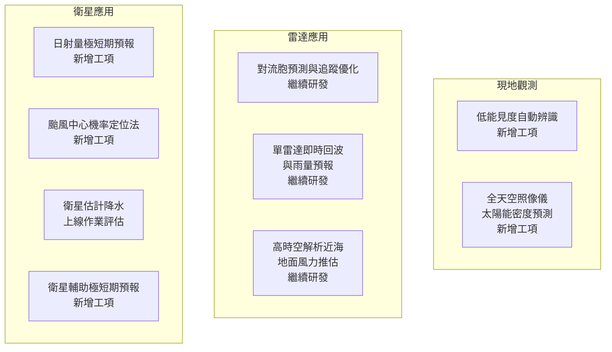

# 分組 5 — 天氣監測與應用技術

> **講者**：劉豫臻 技正（科技發展組）  
> **日期**：2026-04-13  
> **投影片數**：24  
> **原始檔案**：`raw_data/20260413_AIIML教育訓練_分組5.pptx`

---

## 1 觀測系統總覽

氣象署天氣監測仰賴三大觀測系統，各有其優勢與限制：

| 觀測系統 | 優勢 | 限制 |
|----------|------|------|
| **現地觀測** | 可獲得近即時資訊；可觀測的物理量較多 | 分布稀疏 |
| **雷達觀測** | 極高時空解析度；即時監測對流胞與風場 | 僅高層風、偵測距離受限 |
| **衛星觀測** | 極廣監測範圍；可偵測非水象粒子 | 解析差、誤差較大；紅外/可見光僅見雲頂 |

### 1.1 AI 能解決什麼？

| 觀測系統 | AI 應用方向 |
|----------|-------------|
| 現地觀測 | 影像↔數值關聯（能見度、日射量）、即時預警訊號（淹水偵測、低能見度偵測） |
| 雷達觀測 | 對流胞追蹤優化、三維風場/降雨重建、非線性雷達-地面融合修正、Nowcasting |
| 衛星觀測 | 多頻道輻射→降水反演、影像特徵辨識（霧/沙塵/煙）、雲下物理量補缺值、超解析、Nowcasting |

---

## 2 使用的 AI/ML 技術總覽

| 技術 | 用途 |
|------|------|
| **CNN / 3D CNN** | 空間特徵擷取、回波分析 |
| **ConvLSTM** | 時空序列預測 |
| **GAN / DGMR** | 降水即時預報（Nowcasting） |
| **Diffusion** | 高品質影像生成（雲預測、日射量） |
| **MOE（Mixture of Experts）** | 分季降水估計 |
| **Continual Learning** | 模型終身學習、泛化能力強化 |

> 參考文獻：  
> - Suman et al., 2021 — *Skilful precipitation nowcasting using deep generative models of radar*  
> - James et al., 2017 — *Overcoming catastrophic forgetting in neural networks*

---

## 3 114–115 年度 AI 工作重點

---

## 4 雷達應用

### 4.1 對流胞預測與追蹤優化

**動機**：現行 SCIT（Storm Cell Identification and Tracking）系統追蹤方法過於線性，常導致對流胞追蹤失敗或錯誤。

**方法**：
- 依據時間 $t$ 的對流胞經緯度移動向量及合成回波網格資料
- 預測時間 $t+1$ 的對流胞位置
- 再以 $t+1$ 實際觀測搜尋最接近的對流胞，建立時空序列

**114 年成果**：
- 將 AI 追蹤納入 SCIT 後處理 → 降低追蹤破碎對流胞數量
- 追蹤破碎對流胞 = 生命週期僅 1 個體積掃描的胞

**115 年工作**：
- 將二維整合回波分析單元擴展為**三維雷達體積資料解析模組**（2D → 3D 架構）
- 建構單雷達極座標資料預處理流程，產製符合模型輸入規格之三維格點資料

### 4.2 單雷達即時回波與降雨預報

**動機**：克服二維合成回波難以推估系統變化的限制。

**方法**：
- 使用五分山雷達原始極座標 3 層仰角資料
- 輸入：過去 10 個體積掃描（T-9 ~ T）
- 輸出：預測未來第 1 仰角掃描資料（T+1, T+5, T+12 = 6/30/60 分鐘）

**114 年成果**：
- 採用 **VST + 殘差擴散（Residual Diffusion）** 架構
- 使用分類器（Classifier）引導擴散
- 參考 Pavlík (2025) 方法增加高回波數值比例：
  - 計算降水事件權重 → 每年取前 1000 筆 → 確保不同年份樣本均勻
  - 每個起始點取前後 180 分鐘資料

### 4.3 高時空解析度近海地面風力推估

**動機**：
- 繞極軌道衛星反演近海面風場觀測頻率僅約每日 **2 次**
- 雷達反演風場時空解析度極高，但高度位於 3–4 km，非近海面

**方法**：
- 結合雷達雙都卜勒合成高空風場 + 繞極衛星近海面風場
- 建立高空風場 ↔ 近海面風場的對應關係
- 後續可由雷達高空風場即時推估近海面風場

**成果**：
- 參考 Franklin et al. (2003)：近海面風速 ≈ 3 km 高度風速 × **0.93**（颱風眼牆內核）
- 眼牆外圍至半徑 300 km 處風速再減 ~10%
- 已建立 2017–2024 年雷達雙都風與近海面風之逐格點迴歸關係式
- 產品已於 **QPEplus** 呈現結果

---

## 5 衛星應用

### 5.1 衛星估計降水

**動機**：將多頻道衛星觀測轉換為降水，提升過去統計方式從亮溫推估降水的準確度。

**過去成果**：與 QPESUMS、EDA QPE 比較，使用 Full-Year Model 已優於 IMERG Late。

**114 年成果**：
- **MOE（Mixture of Experts）模型**：精進各別季節降水估計能力
- **Continual Lifelong Learning**：強化模型泛化能力
- 未來目標：加強訓練海上降水估計，擴展監測範圍

> 參考文獻：  
> - Yang et al., 2025 — *Deep learning-based precipitation estimation over Taiwan using Himawari satellite observations* (IEEE JSTARS)  
> - Yang et al., 2025 — *Geostationary satellite precipitation estimation in Southeast Asia using domain adaptive deep learning* (IEEE TGRS)

### 5.2 衛星資料輔助極短期預報（QPN）

**研究動機**：
1. **填補空間涵蓋不足** — 填補遠洋及偵測邊界空白，掌握雷達範圍外對流系統移入資訊
2. **捕捉早期對流訊號** — 利用多頻道資料獲取雲物理特徵，捕捉液態水形成前的對流發展

**三種技術路線**：

| 路線 | 方法 | 輸入 |
|------|------|------|
| 01 外延法 | 基於過去降水場移動趨勢向前外推 | 雷達 + 衛星估計降水 |
| 02 AI 技術 | 署內 AI 模型 / NowcastNet（測試中） | 雷達回波 + 衛星模擬回波 |
| 03 AI + 衛星頻道 | trajGRU 模型加入衛星頻道資料 | 雷達 + 衛星估計降水 + 頻道 |

### 5.3 颱風中心機率定位法

**動機**：
- 較弱氣旋環流中心不明顯或有多重對流中心
- JTWC 等定位報告仍含人工主觀判斷誤差

**方法**：
1. **TARFIS**（分析及預報場內插）→ 產生定位中心
2. 自動裁切衛星資料
3. **Geocenter 模型**：輸入 3×9×300×300 + 9，一組模型產生 50 點，三組共 150 點
4. 使用 **CRPS** 作為損失函數（捕捉隨機不確定性）
5. **Gaussian KDE** 產出可視化機率分布圖，疊加雲圖

**關鍵結論**：
- 系集中心校驗精準度已與微波 ADT（ARCHER-2）相當
- 無微波資料時，AI 模型準確度更佳
- 不確定性估計可幫助預報員判斷定位可靠程度

> 參考：Ryan et al., 2026 — *Center Fixing of Tropical Cyclones Using Uncertainty-Aware Deep Learning Applied to High-Temporal-Resolution Geostationary Satellite Imagery*

---

## 6 日射量極短期預報

**目標**：開發 0–3 小時極短期日射量 AI 預測方法，提供電力調度參考。

### 6.1 方法設計

| 步驟 | 內容 |
|------|------|
| 輸入資料 | 間隔 20 分鐘 4 張影像（避免每日 02:40 缺資料） |
| 缺值處理 | 採用 **SLOMO**（影像插值），MSE 比線性內插降低約 50% |
| 預報方法 | 模式預報、光流法（基準）、**DGMR** |
| 標準化 | 以「理論最大日射量」（晴空無氣膠）標準化 → 模型專注學習雲變化 |

### 6.2 版本演進

| 版本 | 特點 |
|------|------|
| DGMR_v0 | 基礎版，系統平移掌握度低 |
| DGMR_v1 | 改進版，約 1 小時後以日射量趨勢為主 |
| **DGMR_v2** | 以最大日射量標準化 → 可掌握系統由西向東移動趨勢 |

### 6.3 比較結果

預報方法比較（案例 2025/09/08）：Satellite Retrieval vs Optical Flow vs **DGMR** vs RWRF，於 1h/2h/3h/6h 時距下比較。

---

## 7 全天空照像儀太陽能密度預測

**動機**：利用全天空照像儀監測雲量、雲狀、雲與太陽的相對位置，從雲層移動變化預測太陽能密度。

### 7.1 訓練資料

| 項目 | 內容 |
|------|------|
| 地點 | 臺北站 |
| 時間 | 2022/03/08 – 2023/07/10 |
| 資料數 | 29 萬筆（剔除雨滴、人、鳥等干擾） |
| 影像處理 | 高品質縮圖減少偽影 |

### 7.2 Diffusion 版雲預測模型

| 模型 | 說明 |
|------|------|
| Transformer + U-net | 基礎架構 |
| **SDV**（Diffusion 版） | 預測圖像更清晰、光影更合理 |
| **SSDV**（SDV + 太陽位置） | 太陽位置預測表現更佳 |

### 7.3 預報效能

- 前 4 報（~20 分鐘）相關性 > 0.9
- 前 11 報（~55 分鐘）相關性 > 0.8
- 低值區部分高估，峰值呈現低估
- Diffusion 版雲細節清晰，但預報時長無法有效延長

---

## 8 低能見度自動辨識技術開發

**動機**：運用 AI 影像辨識取代傳統能見度儀，降低佈建成本與提升即時性，透過多元推播發出警示。

### 8.1 系統流程

### 8.2 AI 影像辨識雛形

- 使用 **Sobel 邊緣偵測**判斷能見度
- 案例：基隆站
  - 2025/07/01 VIS = 75.00 km（清晰，邊緣特徵豐富）
  - 2025/07/25 VIS = 0.46 km（濃霧/霾，物體輪廓模糊，邊緣大幅減少）
- 已開發網頁使用者介面（雛形）

---

## 9 詞彙表

| 縮寫 | 全稱 | 中文 |
|------|------|------|
| SCIT | Storm Cell Identification and Tracking | 對流胞辨識與追蹤系統 |
| QPN | Quantitative Precipitation Nowcasting | 定量降水即時預報 |
| QPEplus | — | 定量降水估計整合平台 |
| QPESUMS | Quantitative Precipitation Estimation and Segregation Using Multiple Sensors | 多感測器降水估計系統 |
| DGMR | Deep Generative Model of Radar | 雷達深度生成模型 |
| MOE | Mixture of Experts | 混合專家模型 |
| ConvLSTM | Convolutional Long Short-Term Memory | 卷積長短期記憶網路 |
| TSMIP | Taiwan Strong Motion Instrumentation Program | 臺灣強地動觀測網 |
| CWBSN | Central Weather Bureau Seismic Network | 中央氣象署寬頻地震網 |
| trajGRU | Trajectory Gated Recurrent Unit | 軌跡門控循環單元 |
| NowcastNet | — | 即時預報神經網路模型 |
| CRPS | Continuous Ranked Probability Score | 連續排序機率評分 |
| TARFIS | — | 分析及預報場內插系統 |
| ADT / ARCHER-2 | Advanced Dvorak Technique / — | 先進 Dvorak 技術 |
| SLOMO | Super SLOwMO (video interpolation) | 影像插值技術 |
| IMERG | Integrated Multi-satellitE Retrievals for GPM | GPM 多衛星整合降水 |
| EDA QPE | — | 系集資料同化定量降水估計 |
| Sobel | — | Sobel 邊緣偵測算子 |
| SDV | — | Diffusion 版全天空雲預測模型 |
| SSDV | — | SDV + 太陽位置版本 |
| KDE | Kernel Density Estimation | 核密度估計 |

---

## 10 參考文獻

1. Suman et al., 2021 — *Skilful precipitation nowcasting using deep generative models of radar*
2. James et al., 2017 — *Overcoming catastrophic forgetting in neural networks*
3. Pavlík, 2025 — 增加高回波數值比例方法
4. Franklin et al., 2003 — 颱風 GPS Dropwindsonde 海面風速統計（1997–1999, 17 颶風, 630 筆）
5. Yang, Y. et al., 2025 — *Deep learning-based precipitation estimation over Taiwan using Himawari satellite observations* (IEEE JSTARS)
6. Yang, Y. et al., 2025 — *Geostationary satellite precipitation estimation in Southeast Asia using domain adaptive deep learning* (IEEE TGRS)
7. Ryan et al., 2026 — *Center Fixing of Tropical Cyclones Using Uncertainty-Aware Deep Learning*

---

## 11 總結摘要

本簡報由科技發展組劉豫臻技正報告分組五「天氣監測與應用技術」，全面涵蓋三大觀測系統（現地、雷達、衛星）的 AI 應用發展。

**雷達領域**：以 3D CNN 優化 SCIT 對流胞追蹤、以 VST + 殘差 Diffusion 進行單雷達即時回波預報、以迴歸方法將高空風場轉換為近海面風場並已在 QPEplus 呈現。

**衛星領域**：MOE + Continual Learning 精進降水估計、NowcastNet/trajGRU 結合衛星輔助 QPN、以 Uncertainty-Aware Deep Learning（CRPS + Gaussian KDE）進行颱風中心機率定位。

**新興應用**：DGMR 系列模型進行 0–3 小時日射量預報、Diffusion 版全天空雲預測模型（SDV/SSDV）預測太陽能密度、Sobel 邊緣偵測開發低能見度自動辨識系統。

整體展現氣象署在 AI/ML 天氣監測上的多面向布局，從傳統觀測到新能源應用均有技術突破。
