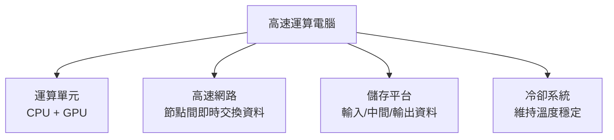
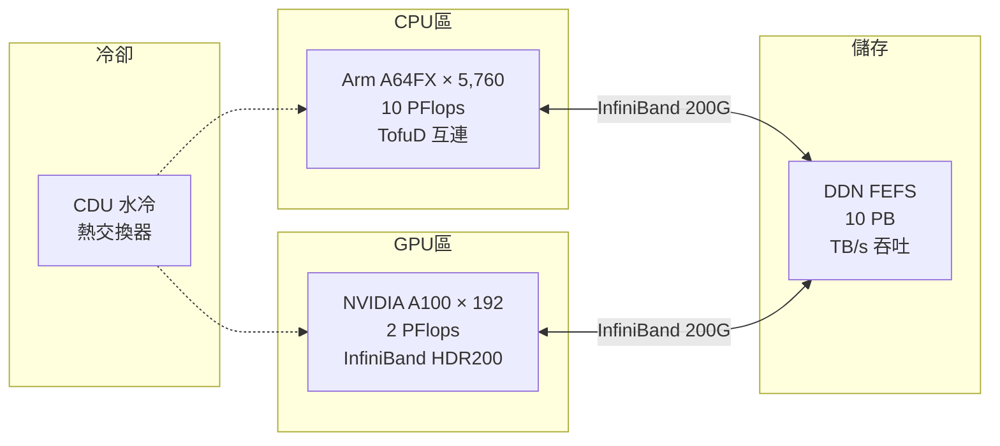

# 分組 7（原分組 6）— 資訊系統與開源環境：高速運算電腦科普篇

> **講者**：莊惟然（數值資訊組）  
> **頁數**：14  
> **原始檔案**：`raw_data/分組6_資訊系統與開源環境.pdf`

---

## 1 什麼是高速運算電腦（HPC）？

**High Performance Computing（HPC）** 的核心特性：

- 由多個計算節點組成，進行**平行運算**
- 每個節點擁有自己的處理器、記憶體與儲存空間
- 提供比單一桌面或伺服器更高的效能
- **優勢**：短時間內處理及分析大量資料
- **算力單位**：PFlops（Peta Floating-point Operations Per Second）

### 1.1 應用領域

大氣科學、物理、化學、數學、工程、生命科學、醫療

### 1.2 臺灣自建 HPC 設施

| 單位 | 設施名稱 |
|------|----------|
| 中央氣象署 | **第 6 代高速運算電腦** |
| 國家高速網路中心 | 晶創 26、臺灣杉二號（TAIWANIA 2）、台灣杉三號（Taiwania 3）、創進一號 |
| NVIDIA | Taipei-1（高雄軟體園區） |

---

## 2 HPC 於氣象領域的應用

```
氣象方程式 → 超級電腦運算 → 預估大氣變化
   (表達)         (運算)         (預估)
```

HPC 是數值天氣預報（NWP）的基石 — 將大氣物理方程式離散化後，以巨量格點進行數值積分。

---

## 3 HPC 四大核心系統



### 3.1 運算單元：CPU vs GPU

| 特性 | CPU（全能型工程師） | GPU（超多工工人團隊） |
|------|---------------------|----------------------|
| 擅長 | 分支預測、條件判斷、複雜演算法、序列計算 | 大規模平行運算、矩陣/向量計算 |
| 用途 | 協調整體系統運作 | AI 模型訓練與推論、科學模擬、圖像處理 |
| 角色 | 處理複雜邏輯 | 專注大量平行運算 |

### 3.2 高速網路：6 大 I/O 介面

AI 驅動資料中心 I/O 加速進化，6 大 I/O 介面同步世代交替（ITHOME 報導）。

### 3.3 儲存系統：三層架構

| 層級 | 技術 | 特性 |
|------|------|------|
| **高速暫存層** | SSD / NVMe 快閃記憶體 | 數 GB/s 讀寫；儲存熱資料與頻繁存取檔案 |
| **快取層** | 中間緩衝層 | 平衡速度與容量，確保存取流暢 |
| **大容量儲存層** | 硬碟陣列 / 磁帶系統 | PB 級容量；長期保存原始資料、歷史紀錄與備份 |

整體儲存能力：

| 指標 | 數值 |
|------|------|
| 平行存取 | 支援數千節點同時讀寫 |
| 讀寫速度 | 高達 TB/s |
| 總容量 | 數 PB 至數十 PB |
| 資料保護 | 多重備份與錯誤修正 |

### 3.4 冷卻系統：浸沒式液冷

- **核心機制**：將伺服器整機或關鍵元件直接浸泡在絕緣冷卻液中
- 適用對象：高功耗 HPC、高效能 GPU、AI 伺服器
- **優點**：
  - 降低機房空調需求，減少 **PUE**（Power Usage Effectiveness）
  - 降低噪音、減少機械風扇故障
  - 延長硬體壽命、提升穩定度

---

## 4 本署高速運算電腦發展歷程

氣象署歷經多代 HPC 升級，從早期系統演進至現行第 6 代高速運算電腦。

---

## 5 第 6 代高速運算電腦規格

### 5.1 CPU 區

| 項目 | 規格 |
|------|------|
| CPU | 台積電 7 nm 製程 **Arm 架構 A64FX** 2.2 GHz / 48 Core |
| 節點數 | 384 Node × 15 櫃 → **5,760 顆 CPU** |
| 算力 | **10 PFlops** |
| 互連 | TofuD（6-Mesh/Torus） |
| 記憶體總量 | 180 TiB |

### 5.2 GPU 區

| 項目 | 規格 |
|------|------|
| GPU | **NVIDIA A100** |
| 數量 | 24 台 × 8 張 = **192 張** |
| 算力 | **2 PFlops** |
| 互連 | InfiniBand HDR200 |
| 網路 | 100 Gbps Ethernet |

### 5.3 高速網路

- NVIDIA InfiniBand 200G × 18 台
- 串接 CPU 與 GPU 於 DDN 上

### 5.4 儲存平台

- **FEFS + DDN 儲存系統**
- Storage Capacity：1 PB × 10 台 OSS/OST
- 提供高效能及高擴展性

### 5.5 冷卻

- **CDU 水冷分熱交換器**



---

## 6 詞彙表

| 縮寫 | 全稱 | 中文 |
|------|------|------|
| HPC | High Performance Computing | 高速運算電腦 |
| PFlops | Peta Floating-point Operations Per Second | 每秒千兆次浮點運算 |
| CPU | Central Processing Unit | 中央處理器 |
| GPU | Graphics Processing Unit | 圖形處理器 |
| NVMe | Non-Volatile Memory Express | 非揮發性記憶體快速存取協定 |
| SSD | Solid State Drive | 固態硬碟 |
| PUE | Power Usage Effectiveness | 電源使用效率 |
| InfiniBand | — | 高頻寬低延遲互連技術 |
| TofuD | — | Fujitsu 6-Mesh/Torus 互連拓撲 |
| DDN | DataDirect Networks | 高效能儲存供應商 |
| FEFS | Fujitsu Exabyte File System | 富士通 EB 級檔案系統 |
| OSS/OST | Object Storage Server / Target | 物件儲存伺服器 / 目標 |
| CDU | Coolant Distribution Unit | 冷卻液分配單元 |
| A64FX | — | Fujitsu Arm 架構 HPC 處理器 |

---

## 7 總結摘要

本簡報由數值資訊組莊惟然介紹 HPC 科普知識與氣象署第 6 代高速運算電腦。HPC 由四大核心系統組成：**運算單元**（CPU 處理複雜邏輯 + GPU 大量平行運算）、**高速網路**（InfiniBand 200G 互連）、**儲存平台**（三層架構：NVMe 暫存 → 快取 → PB 級大容量）、**冷卻系統**（浸沒式液冷降低 PUE）。

氣象署第 6 代 HPC 採用 Arm 架構 A64FX 處理器 5,760 顆（10 PFlops）搭配 192 張 NVIDIA A100 GPU（2 PFlops），總算力達 **12 PFlops**，儲存容量 10 PB，是數值天氣預報與 AI 模型訓練的運算基石。
