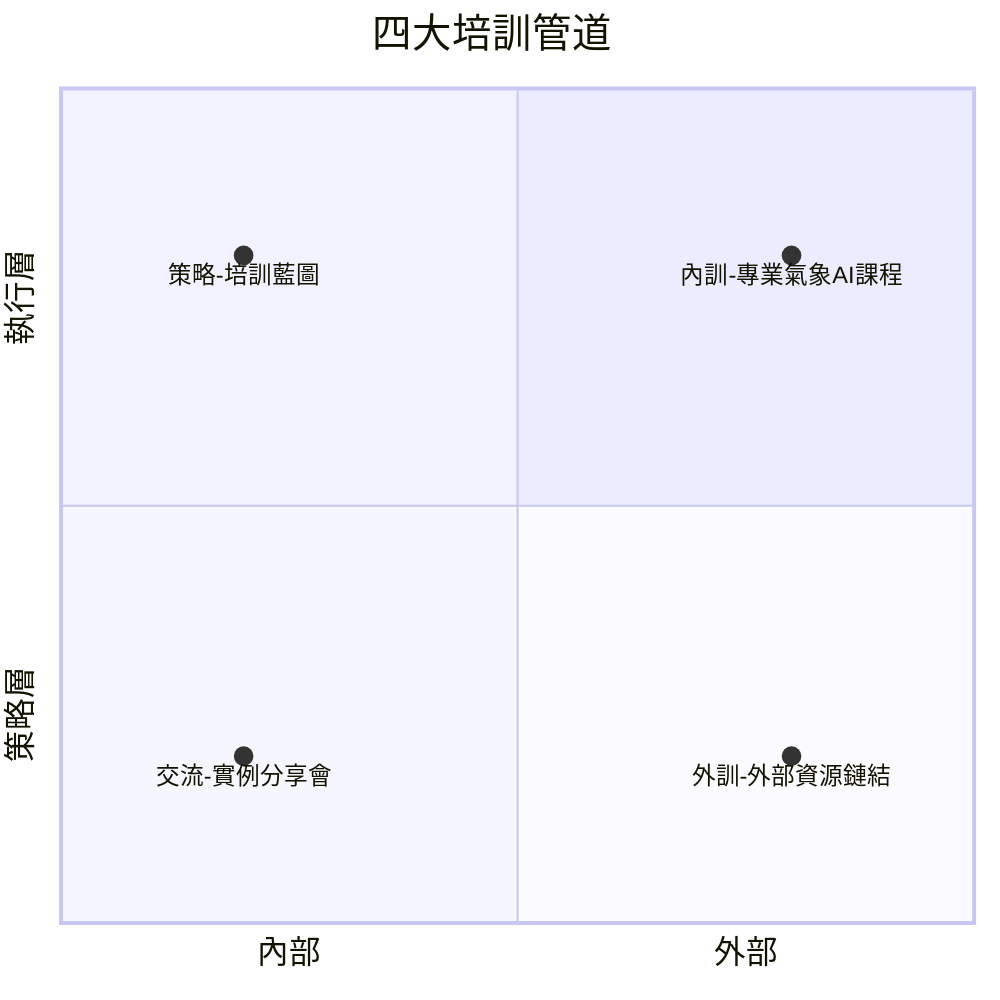
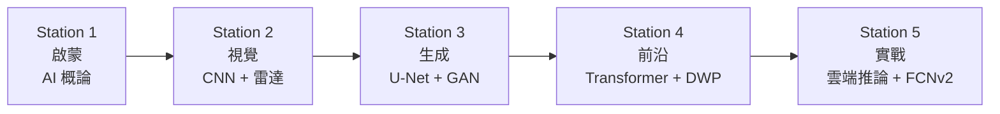
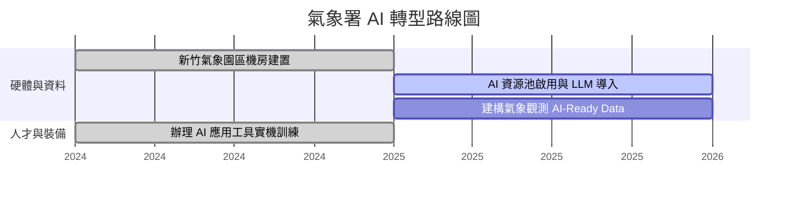

# 分組 8 — AI 人才培育：導航氣象 AI 新時代

> **單位**：交通部中央氣象署 AI 技術應用小組  
> **日期**：2026-04-15  
> **頁數**：11  
> **原始檔案**：`raw_data/分組八_AI人才培育0415.pdf`（圖片式 PDF，無可提取文字）

---

## 1 核心理念

> **機器建構未來，但「人」才是核心。**

氣象署正積極佈建 HPC 與超級電腦環境，然而最強大的算力若無具備 AI 視角的人才驅動，便無法發揮價值。分組八的唯一使命：**確保您在氣象 AI 轉型中不被落下。**

### 1.1 分組八在整體架構中的定位

分組八「人工智慧技術人才培育」居於核心樞紐位置，連接周邊各業務面向：
- 天氣預報模型
- 資料整集與重建
- 軟硬體基礎建設

---

## 2 三大培育目標

| # | 目標 | 說明 |
|---|------|------|
| 01 | **精準賦能** | 透由專業資訊團隊，規劃符合本署業務發展所需的 AI 技能 |
| 02 | **跨域突破** | 提供多元技術課程參訓機會，突破現有氣象思維框架 |
| 03 | **接軌前沿** | 廣泛吸收前瞻 AI 新知，定期舉辦趨勢專題演講，提升科技視野 |

---

## 3 四大培訓管道

### 3.1 策略 — 培訓藍圖

參照數發部 AI 學習地圖，研擬氣象署專屬教育訓練計畫。

### 3.2 內訓 — 專業氣象 AI 課程

邀請臺大等頂尖學者入署，提供從基礎到實作的系統性長程培訓。

### 3.3 交流 — 實例分享會

跨單位的 AI 實際導入經驗與失敗學習分享。

### 3.4 外訓 — 外部資源鏈結

全額補助參與外部專業訓練及大型論壇，探索技術落地應用。

---

## 4 AI 角色定位：尋找你的學習路徑

> **您不需要學會所有技術！依照您的業務角色，選擇最精準的學習路徑。**

| 角色 | 職責定位 | 所需技能 |
|------|---------|---------|
| **規劃者** | 藍圖規劃、治理風險、跨部門落地 | AI 素養、政策評估、公共創新實驗 |
| **應用者** | 日常業務提效、資料處理、流程優化 | 工具場景導入、基礎資料治理、服務升級 |
| **開發者** | 模型開發、委外規格撰寫、MLOps | AI/ML 應用開發實務、資安與合規 |

---

## 5 內訓課程路線圖：五站式學習旅程

**師資陣容**：臺大天災中心 陳柏孚博士等頂尖學者  
**特色**：結合氣象真實數據（衛星、雷達）進行實機操作

| 站別 | 主題 | 內容 |
|------|------|------|
| Station 1 | **啟蒙** | AI 概論、機器學習與神經網路基礎 |
| Station 2 | **視覺** | CNN 訓練與雷達降水估計實作 |
| Station 3 | **生成** | U-Net、GAN 與時間序列預測 |
| Station 4 | **前沿** | Transformer、全球資料導向天氣預報（DWP） |
| Station 5 | **實戰** | 雲端 AI 模型推論、FCNv2 多模型優化實作 |

---

## 6 外訓與線上資源

### 6.1 線上微學習

| 項目 | 內容 |
|------|------|
| 平台 | e 等公務園、數發部數位人才平臺 |
| 主題 | Prompt 提示語實戰、生成式 AI 應用（簡報設計、影片創作、圖像生成） |
| 特色 | 適合零碎時間快速充電 |

### 6.2 實體大視野

| 項目 | 內容 |
|------|------|
| 課程 | 派訓參與外部專業 AI 訓練課程 |
| 活動 | 參加國內氣象論壇，或參與 AI 相關講習 |

---

## 7 跨域交流：從做中學的 AI 文化

### AI 實例分享會

| 面向 | 說明 |
|------|------|
| **真實案例** | 從地震測報到雷達觀測，分享實際導入 AI 技術的業務經驗 |
| **痛點解析** | 不只談成功，更探討資料前處理、模型選擇的真實挑戰 |
| **頻率** | 每季定期辦理，促進署內不同科室的技術思維碰撞 |

---

## 8 Insight Dashboard — 課程成效

| 指標 | 數值 |
|------|------|
| 課程整體滿意度 | **100%** |
| 講師授課滿意度 | **94%** |

### 學員最看重的內容（The Core Value）

| 主題 | 比例 |
|------|------|
| 神經網路基礎 | 61% |
| 概論與簡介 | 56% |
| 機器學習 | 50% |

### 學員回饋與未來展望（The Horizon）

學員期望增加：
- 「觀測資料 QC 案例」
- 「AI 模型選擇策略」
- 「非氣象領域應用」

> **Update：分組八已納入 115 年規劃！**

---

## 9 114–115 年路線圖

| 時程 | 硬體與資料 | 人才與裝備 |
|------|----------|----------|
| Year 114 | 新竹氣象園區機房建置 | 辦理 AI 應用工具實機訓練 |
| Year 115 | AI 資源池啟用與 LLM 導入 → 建構氣象觀測 AI-Ready Data | 持續培訓 |

### 專屬您的第一站

- **活動**：新進同仁認識本署業務應用 AI 現況
- **時間**：115 年 4/20 – 4/21
- **亮點**：全貌理解 CWA 轉型地圖，與各業務分組長面對面交流

---

## 10 您的專屬行動清單

| ☐ | 行動 | 說明 |
|---|------|------|
| ☐ | **定位自我** | 確認自己在新崗位上是「規劃者」、「應用者」還是「開發者」 |
| ☐ | **踏出首步** | 登入「e 等公務員」，完成一堂 10 分鐘的 Generative AI 微課程 |
| ☐ | **標記行事曆** | 預留 115 年 4/20–21，參加新進同仁 AI 專屬訓練營 |
| ☐ | **開啟對話** | 與您的主管討論業務中潛在的 AI 應用場景 |

> **歡迎登艦，與分組八一同導航氣象 AI 新時代！**

---

## 11 詞彙表

| 縮寫 | 全稱 | 中文 |
|------|------|------|
| HPC | High Performance Computing | 高速運算電腦 |
| MLOps | Machine Learning Operations | 機器學習維運 |
| DWP | Data-driven Weather Prediction | 資料導向天氣預報 |
| FCNv2 | FourCastNet v2 | NVIDIA 全球天氣 AI 模型 |
| CNN | Convolutional Neural Network | 卷積神經網路 |
| GAN | Generative Adversarial Network | 生成對抗網路 |
| LLM | Large Language Model | 大型語言模型 |
| CWA | Central Weather Administration | 中央氣象署 |
| QC | Quality Control | 品質管控 |

---

## 12 總結摘要

本簡報由氣象署 AI 技術應用小組介紹分組八「AI 人才培育」的整體規劃。核心理念為「機器建構未來，但人才是核心」，提出三大目標（精準賦能、跨域突破、接軌前沿）與四大培訓管道（策略藍圖、內訓課程、實例分享會、外訓資源）。

內訓課程設計為五站式學習旅程（啟蒙→視覺→生成→前沿→實戰），由臺大陳柏孚博士等頂尖學者授課，結合氣象真實數據實機操作。課程成效顯著（整體滿意度 100%、講師滿意度 94%）。同時依據人員角色（規劃者/應用者/開發者）區分學習路徑，搭配線上微學習平台與外部論壇派訓，構建完整的 AI 人才培育生態系。115 年規劃將持續推進 AI 資源池、LLM 導入與 AI-Ready Data 建構。
